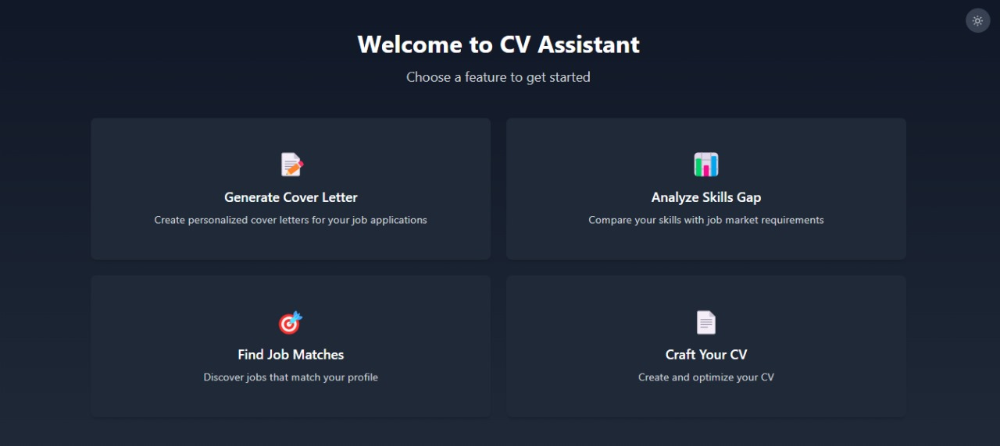
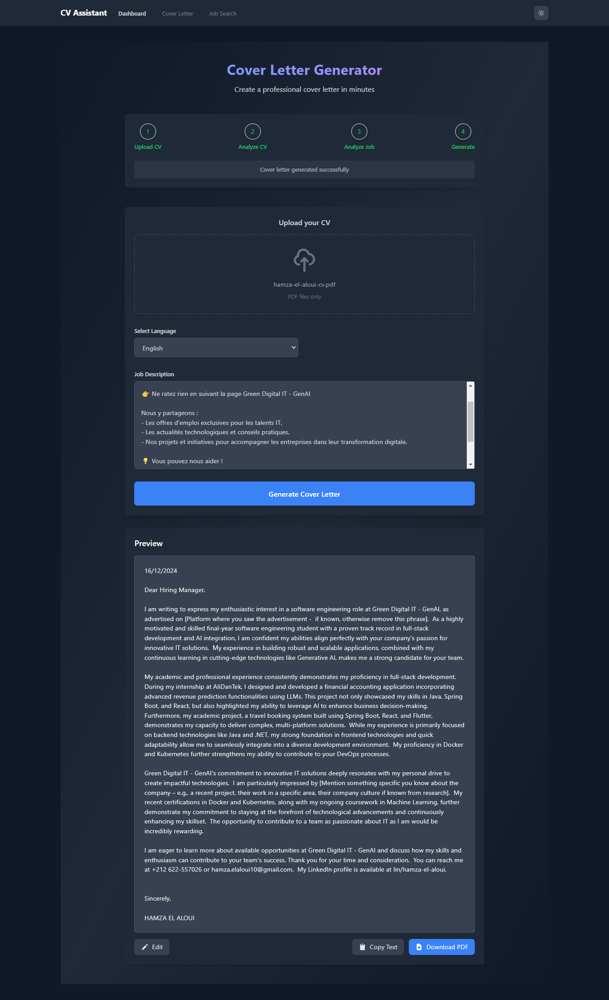
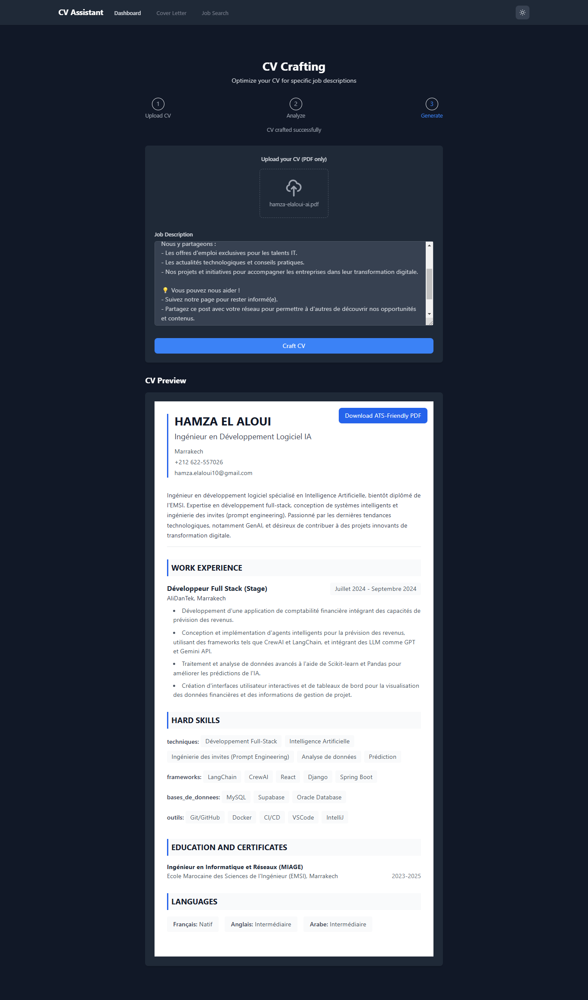
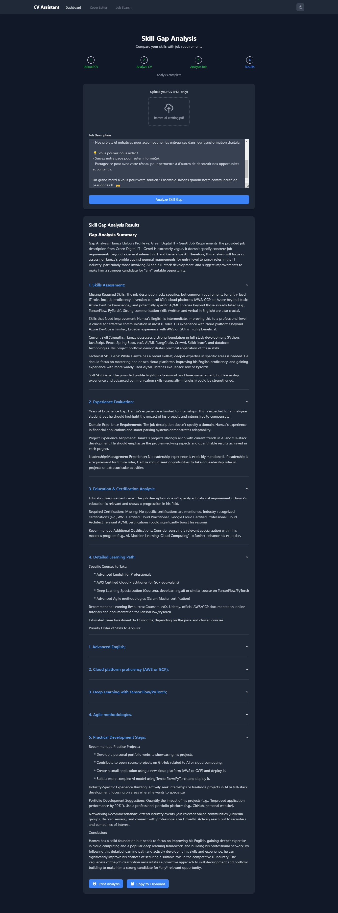
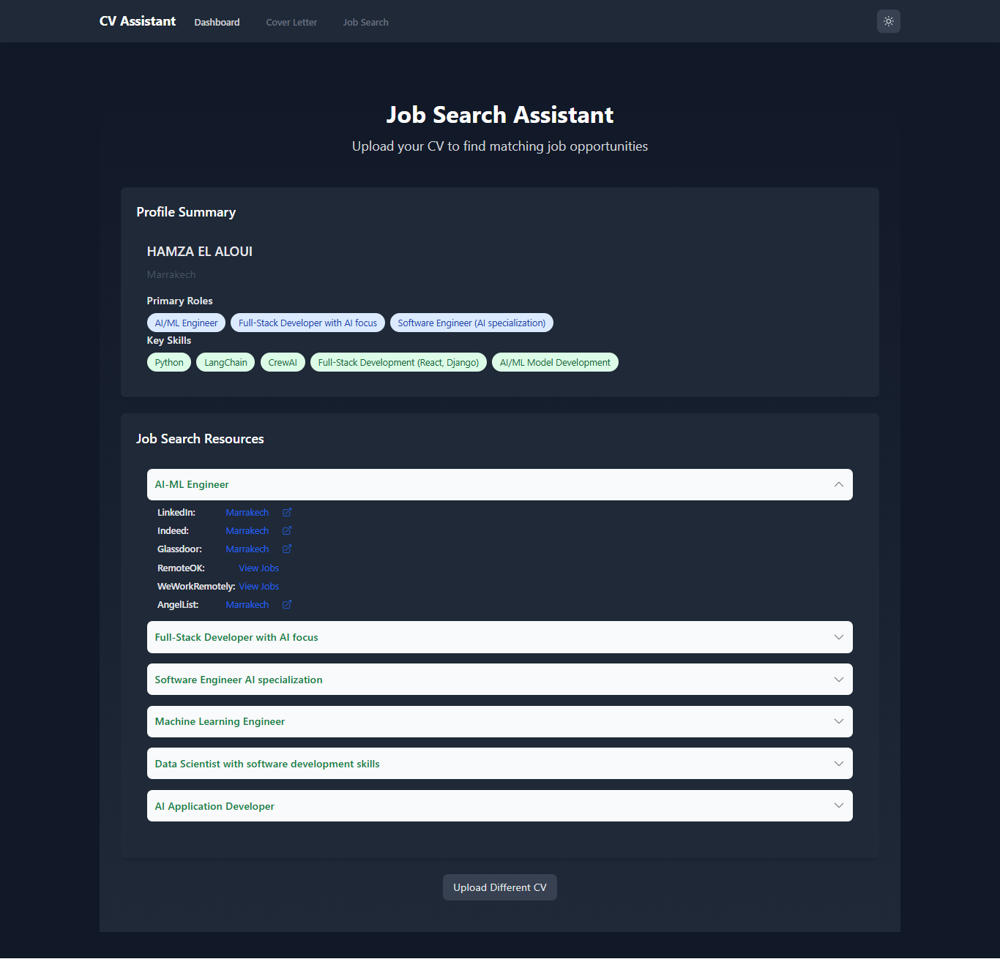
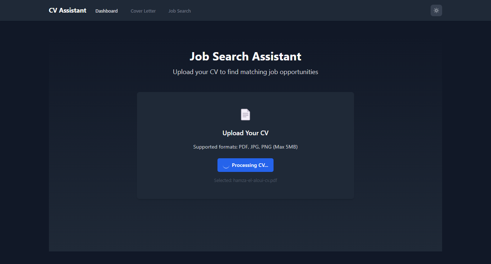

# iCareer

**iCareer** is an AI-powered web application that assists users in generating cover letters, analyzing skill gaps, crafting resumes, and finding job opportunities based on their CVs and job descriptions. Built with **Django, LangChain, Gemini 1.5 Flash API, React, and Tailwind CSS**, it simplifies the job application process with automation and intelligent suggestions.

## Features

### Home Page

- **Description**: The entry point of iCareer where users can choose a feature to begin their journey.
- **Available Features**:
  - Generate a Cover Letter
  - Analyze Skill Gaps
  - Craft a CV
  - Find Job Matches
- **Technologies Used**:
  - React (Frontend UI)
  - Tailwind CSS (Styling)

### Cover Letter Generator

- **Description**: Generates a customized cover letter based on the user's CV and job description.
- **Steps**:
  1. Upload a CV (PDF format only).
  2. Copy and paste the job description.
  3. Click "Generate Cover Letter" to create a professional, tailored letter.
  4. Preview, edit, and download the generated cover letter as a PDF.
- **Technologies Used**:
  - Django (Backend API)
  - LangChain (AI Processing)
  - Gemini 1.5 Flash API (AI Model for NLP)
  - React (Frontend UI)
  - Tailwind CSS (Styling)

### CV Crafter

- **Description**: Optimizes and tailors a CV based on the job description.
- **Steps**:
  1. Upload an existing CV.
  2. Provide the job description.
  3. The system analyzes the job requirements and adjusts the CV accordingly.
  4. Preview and download the optimized CV as an ATS-friendly PDF.
- **Technologies Used**:
  - Django
  - React
  - Tailwind CSS
  - LangChain + Gemini API (AI-powered CV enhancement)

### Skill Gap Analysis

- **Description**: Compares the user's CV with the job description to identify missing skills and suggest improvements.
- **Steps**:
  1. Upload the CV.
  2. Provide the job description.
  3. The system generates a detailed skill gap analysis, including:
     - Missing skills
     - Strengths and weaknesses
     - Suggested courses and certifications
     - Recommended industry practices
  4. Users can print or copy the analysis.
- **Technologies Used**:
  - Django
  - LangChain + Gemini API
  - React + Tailwind CSS

### Job Search Assistant

- **Description**: Provides job opportunities based on the user's CV and skillset.
- **Steps**:
  1. Upload the CV.
  2. The system extracts key skills and suggests job titles.
  3. Provides links to job listings on LinkedIn, Indeed, Glassdoor, RemoteOK, WeWorkRemotely, and AngelList.
  4. Users can explore and apply for suitable jobs directly.
- **Technologies Used**:
  - Django (API & Backend Processing)
  - React + Tailwind CSS (Frontend UI)
  - Web Scraping/API Calls (Fetching job listings)

### Job Search Processing

- **Description**: Displays the status of CV processing while searching for job opportunities.
- **Steps**:
  1. Upload your CV.
  2. The system processes the file and extracts key information.
  3. Users wait while their CV is analyzed for relevant job suggestions.
- **Technologies Used**:
  - Django
  - React + Tailwind CSS
  - LangChain + Gemini API

## How to Run the Project
### 1. Clone the Repository
```sh
   git clone https://github.com/your-repo/icareer.git
   cd icareer
```
### 2. Set Up Backend (Django)
```sh
   python -m venv env
   source env/bin/activate  # On Windows: env\Scripts\activate
   pip install -r requirements.txt
   python manage.py migrate
   python manage.py runserver
```
### 3. Set Up Frontend (React)
```sh
   cd frontend
   npm install
   npm start
```
### 4. Environment Variables
Create a `.env` file in the root directory and add:
```sh
GEMINI_API_KEY=your-api-key
DJANGO_SECRET_KEY=your-secret-key
```

## Contributors
- **Your Name** (@yourGithubUsername)

## License
This project is licensed under the MIT License - see the LICENSE file for details.
